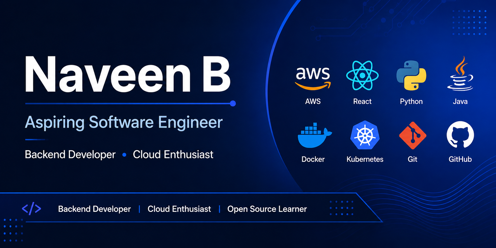

```markdown
<!-- ===================================================== -->
<!--              GitHub Profile README                    -->
<!--        GitHub Username: naveenbb1473                  -->
<!-- ===================================================== -->

<p align="center">
  
</p>

<h1 align="center">Hi 👋, I'm Naveen B</h1>

<h3 align="center">
Software Engineering Student | Backend Developer | Cloud Enthusiast | Open Source Learner
</h3>

<p align="center">

[](https://git.io/typing-svg)

</p>

---

## 👨‍💻 About Me

🎓 Software Engineering Student based in **Vellore, India**

☁ AWS Certified Cloud Practitioner

💻 Passionate about Backend Development and Cloud Computing

🚀 Currently learning **React, AWS, Docker, Kubernetes, Python, and Java**

🌱 Interested in building secure, scalable, and real-world software solutions

🎯 Career Goal: **Software Engineer**

---

## 🌐 Connect With Me

<p align="center">

<a href="mailto:naveenbb1473@gmail.com">

</a>

<a href="https://www.linkedin.com/in/naveen-b-3b63532aa/">

</a>

<a href="https://drive.google.com/file/d/1z_GJRc4-VDZfGA5e6BoSRpz-ErT9utUd/view?usp=drive_link">

</a>

</p>

---

## 💻 Tech Stack

<p align="center">


</p>

---

## 🛠 Tools & Technologies

| Category | Technologies |
|-----------|--------------|
| Languages | Java, Python, JavaScript, SQL |
| Frontend | HTML5, CSS3, React |
| Backend | FastAPI |
| Databases | MySQL, SQLite |
| Cloud | AWS |
| DevOps | Docker, Kubernetes |
| Version Control | Git, GitHub |
| IDEs | VS Code, IntelliJ IDEA, Android Studio |
| Design | Figma |
| Server | Apache Tomcat |
| Operating System | Linux, Windows |

---

# 🚀 Featured Projects

## 📚 Course Exchange Platform

A premium web application designed for VIT students to exchange and manage course slots securely.

### Features

- Responsive Dashboard
- Secure Chat System
- Notification Tracking
- Database Integration

**Tech Stack**

`Java` `MySQL` `HTML5` `CSS3` `Apache Tomcat`

🔗 Repository

https://github.com/naveenbb1473/CourseExchangePlatform

---

## 🤖 Multimodal Meme Moderation System

An AI-powered moderation system that combines Computer Vision and Natural Language Processing to detect harmful memes, offensive content, hate speech, and sarcasm.

### Features

- Computer Vision
- NLP
- Harmful Meme Detection
- AI Moderation

**Tech Stack**

`Python` `HTML` `CSS` `JavaScript`

🔗 Repository

https://github.com/naveenbb1473/Negative-meme-detection

---

## 👁 Eye Movement Authentication (IrisCrypt)

A zero-knowledge end-to-end encrypted chat application protected using biometric eye movement authentication.

### Features

- Eye Movement Authentication
- End-to-End Encryption
- Secure Login
- Real-Time Chat

**Tech Stack**

`Python`

`OpenCV`

`FastAPI`

`SQLite`

`HTML`

`CSS`

🔗 Repository

https://github.com/naveenbb1473/eye_movement_security

---

# 📜 Certifications

🏆 AWS Certified Cloud Practitioner

🏆 IBM Back-End Development Professional Certificate

🏆 IBM Full Stack Software Developer Professional Certificate

---

# 📚 Currently Learning

- React
- AWS
- Docker
- Kubernetes
- Python
- Java

---

# 🎯 2026 Goals

- Build production-ready backend applications
- Master Cloud Computing
- Learn DevOps practices
- Contribute to Open Source
- Build impactful software projects
- Strengthen Data Structures & Algorithms

---

# 📊 GitHub Statistics

<p align="center">


</p>

---

# 🔥 GitHub Streak

<p align="center">


</p>

---

# 📈 Contribution Graph

<p align="center">


</p>

---

# 🏆 GitHub Trophies

<p align="center">


</p>

---

# 👀 Profile Visitors

<p align="center">


</p>

---

# 📌 Pinned Projects

⭐ Course Exchange Platform

⭐ Multimodal Meme Moderation System

⭐ Eye Movement Authentication

---

# 💡 Interests

- ☁ Cloud Computing
- 💻 Backend Development
- 🔐 Cyber Security
- 🤖 Artificial Intelligence
- 🌍 Open Source
- 🧩 Problem Solving

---

# 📫 Contact

📧 **Email**

naveenbb1473@gmail.com

💼 **LinkedIn**

https://www.linkedin.com/in/naveen-b-3b63532aa/

📄 **Resume**

https://drive.google.com/file/d/1z_GJRc4-VDZfGA5e6BoSRpz-ErT9utUd/view?usp=drive_link

---

<p align="center">

### ⭐ Thanks for visiting my profile!

*"Building software that solves real-world problems, one project at a time."*

</p>
```
